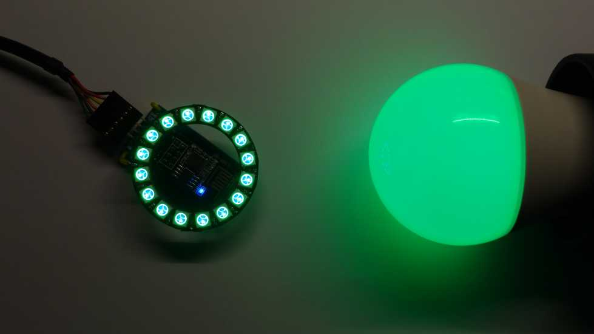
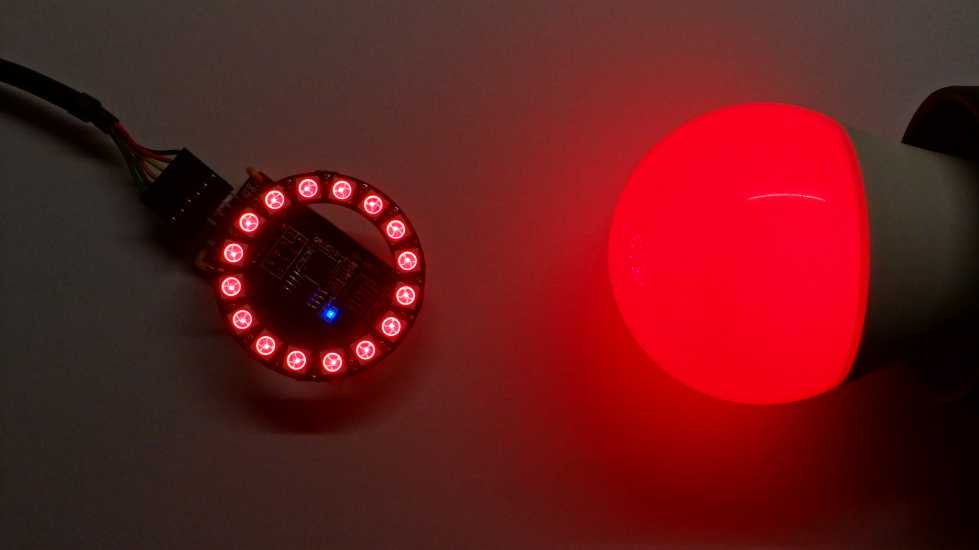
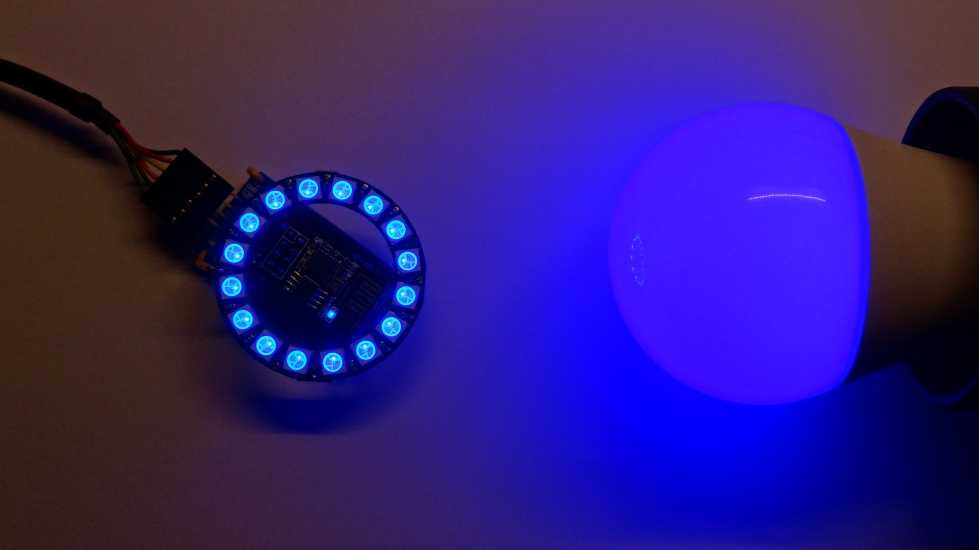
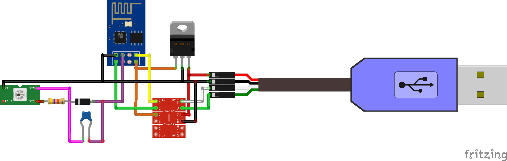
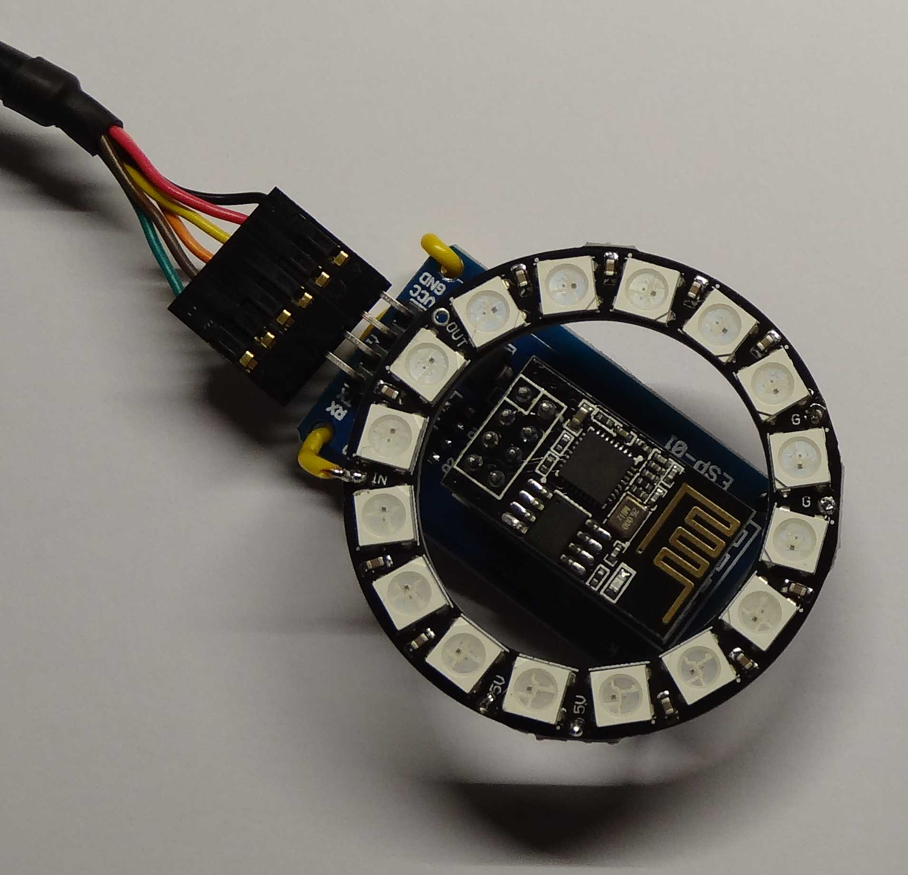

[English description below](README.md#english)

# teams2tasmota
a busylight for MS Teams with a tasmota device

## Kurzbeschreibung
Teams2Tasmota wertet die Logdatei von *Microsoft Teams* aus um den aktuellen Präsensstaus auf dem lokalen Rechner zu ermitteln und zu einem Busylight zu senden. Als Busylight können verschiedene Geräte auf Basis von der Quelloffenen *Tasmota*-Software eingesetzt werden. Die Übertragung der Kommandos vom PC zum Busylight erfolgt entweder über eine Serielle Schnittstelle oder IP-Basiert über LAN/WLAN.

## Versionshistorie
Version	| Datum		| Beschreibung                   |
--------|-----------|--------------------------------|
0.1.0	| 06.02.21	| Erste veröffentlichte Version
0.2.0	| 06.03.21	| Blinken bei eingehendem Anruf (Bitte aktuelle xml verwenden)
0.2.1	| 13.03.21  | Blinken kann für Chat und Call einzeln aktiviert werden. siehe Settings
0.3.0   | 07.04.21  | Zentraler Dimmer für die allgemeine Helligkeit, WebPassword kann in Settings gesetzt werden
0.4.0   | 04.02.23  | Powermanagement Standby- /Resume- Erkennung, Com-Port mit Name, Fenster in Fordergrund bei Doppelklick auf TrayIcon

## Features
* Software erkennt alle Präsenszustande von Microsoft Teams
* Reine lokale Anwendung ohne Nutzung von Cloud-Diensten (z.B. Microsoft Graph Presence API)
* Es werden keine Microsoft Zugangsdaten oder besondere Berechtigungen benötigt
* Verwendung der kostenlosen quelloffen Tasmota Firmware für ESP8266 basierte Geräte
* Geeignete Tasmota Gräte können fertig gekauft oder selbst hergestellt werden.
* Tasmota RGB-LED-Lampe https://de.aliexpress.com/w/wholesale-athom-tasmota-bulb.html
* Bei Verwendung von WLAN kann das Busylight ohne die Verlegung von Kabel z.B. Im Flur vor der HomeOffice Tür angebracht werden um Mitbewohner optimal zu informieren.

## Der erste Start
Teams2Tasmota.exe benötigt im gleichen Verzeichnis die config.xml und greift auf die Logdatei "%AppData%\Microsoft\Teams\logs.txt" von MS-Teams zu.

## Details

Die hier vorgestellte Software entstand, weil mit zunehmendem HomeOffice-Anteil auch der Anteil der Telefon- / Videokonferenzen stieg und damit auch Wunsch den Mitbewohnern mitzuteilen wann man gestört werden kann und wann besser nicht. Die Idee des Busylights ist ja nicht neu, aber die auf dem Markt erhältlichen Produkte und DIY-Lösungen erfüllten nicht meine Anforderungen. Ich wollte ein preiswertes Busylight, dass ich vor der Tür meines HomeOffice anbringen kann ohne dort lange Kabel hin Verlegen zu müssen. Viele andere Teams-Busylight Lösungen basieren auf der von Microsoft dafür vorgesehenen Microsoft Graph API. Diese wollte ich aber nicht verwenden, weil es mir unsinnig erschien, den aktuellen Zustand aus der Cloud abzurufen wenn dieser doch lokal auf dem PC schon vorhanden ist. Außerdem sind dafür auch Berechtigungen notwendig, die gegeben falls erst von Admistratoren eingeräumt werden müssen. Nachdem ich dann über die Log-Datei von MS Teams gestolpert bin und gesehen habe, dass dort die Präsenszustände immer aktuell geloggt werden habe ich eine Software in C# entwickelt die diese auswertet und in Kommandos für die Tasmota-Firmware umsetzt. Diese Kommandos können dann entweder per USB/ComPort zur seriellen Schnittstelle des ESP 8266 übertragen werden oder per WLAN über einen WebRequest dorthin gelangen.

## Selbstbau Busylight auf Basis des ESP-01 mit WS2812 LEDring

Hier vorgestellt ist nur eine mögliche Lösung für den Selbstbau eines Busylights. Statt des ESP01 kann selbstverständlich auch eine nodeMCU verwendet werden. Das würde dann das FTDI Adapterkable und den ESP01 Adapter sparen. Das muss jeder selbst entscheiden.
Benötigte Bauelemente:
* [ESP-01 Modul (ESP2866 Mircocontroller mit WLAN)](https://de.wikipedia.org/wiki/ESP8266)
* [ESP-01 Adapter mit 3,3V Spannungsregler und level shifter](https://www.makershop.de/module/schnittstellen/esp-01-adapter-breakout-2/)
* [FTDI RS 232 Adapterkabel für die Umsetzung von USB auf RS232 TTL und die Versorgung mit 5V](https://ftdichip.com/products/ttl-232r-5v/)
* [RGB LED Ring mit WS2812 LEDs](https://www.roboter-bausatz.de/p/16bit-rgb-led-ring-ws2812-5v-aehnl.-neopixel)
* Wiederstand 4,7 kOhm
* Diode 1N4148
* Kondensator 100nF

Für die Ansteuerung des WS2812 LEDrings ist ein 5V Signal notwendig. Der ESP8266 wird jedoch mit 3,3 Volt betrieben und nutzt für die IOs auch 3,3V. Dies ist für die WS2812-LEDs nicht ausreichend. Um die Signalspannung anzupassen kann man spezielle LEVEL-Shifter verwenden oder wie in meinem Fall eine einfache Kombination von Diode, Pull-Up Widerstand und Kondensator. Der 5 V Pull-Up Widerstand und Diode werden in Reihe an den IO-Pin des ESP angeschlossen. So entsteht an der Diode ein Spannungsabfall von 0,7 V. Schaltet der ESP nun seinen Ausgang auf High so entstehen 3,3 V + 0,7 V = 4 V. Das ist für die WS2812 ausreichend für einen High-Pegel. Schaltet der ESP auf Low so entstehen nur 0,7V als Ausgangsignal was von den WS2812 als Low erkannt wird. Bei schnellem Umschalten zwischen Low und High steigt die Spannung an den WS2812 aber nur langsam, da diese eine nennenswerte Eingangskapazität aufweisen. Damit für die WS2812 nun ein sauberes Rechtecksignal zur Verfügung gestellt werden kann. Wird die Spannung über der Diode mit einem Kondensator konstant gehalten.

# English:
# teams2tasmota
a busylight for MS Teams with a tasmota device

## Short description
Teams2Tasmota evaluates the log file of *Microsoft Teams* to determine the current presence congestion on the local computer and send it to a Busylight. As Busylight different devices based on the open source *Tasmota* software can be used. The transmission of the commands from the PC to the Busylight is done either via a serial interface or IP-based via LAN/WLAN.

## Version history
Version | Date		| Description                    |
--------|-----------|--------------------------------|
0.1.0	| 06.02.21	| First released version 
0.2.0	| 06.03.21	| Flashing on incoming call	(Please use current xml)
0.2.1	| 13.03.21	| Flashing can be activated for chat and call individually see Settings
0.3.0   | 07.04.21  | Central dimmer for general brightness, WebPassword can be set in Settings
0.4.0   | 04.02.23  | Powermanagement Standby- /Resume- recognition, Com-Port with Name, Window in foreground on double click TrayIcon

## Features
* Software recognizes all presence states of Microsoft Teams
* Pure local application without using cloud services (e.g. Microsoft Graph Presence API)
* No Microsoft credentials or special permissions required
* Use of free open source Tasmota firmware for ESP8266 based devices
* Suitable Tasmota devices can be bought ready-made or made by yourself.
* Tasmota RGB LED lamp https://de.aliexpress.com/w/wholesale-athom-tasmota-bulb.html
* When using WLAN, the Busylight can be installed without laying cables e.g. In the hallway in front of the HomeOffice door to inform roommates optimally.

## The first start
Teams2Tasmota.exe needs config.xml in the same directory and accesses the log file "%AppData%\Microsoft\Teams\logs.txt" from MS-Teams.

## Details

The software presented here came into being, because with increasing home office share also the share of telephone / video conferences increased and with it also desire to inform the flatmates when one can be disturbed and when better not. The idea of the Busylight is not new, but the products and DIY solutions available on the market did not meet my requirements. I wanted an inexpensive Busylight that I could install in front of my home office door without having to run long cables to it. Many other Teams Busylight solutions are based on Microsoft's Graph API. But I didn't want to use it, because it seemed nonsensical to me to retrieve the current status from the cloud when it is already available locally on the PC. In addition, permissions are required for this, which may have to be granted by administrators first. After I stumbled across the log file of MS Teams and saw that the presence states are always logged there, I developed a software in C# that evaluates them and converts them into commands for the Tasmota firmware. These commands can then either be transferred via USB/ComPort to the serial interface of the ESP 8266 or reach it via WLAN over a WebRequest.

## Selfmade Busylight based on ESP-01 with WS2812 LEDring

Presented here is only one possible solution for the self-construction of a Busylight. Instead of the ESP01 you can also use a nodeMCU. This would save the FTDI adapter cable and the ESP01 adapter. Everybody has to decide for himself.
Required components:
* [ESP-01 Module (ESP2866 Mircocontroller with WLAN)](https://de.wikipedia.org/wiki/ESP8266)
* [ESP-01 adapter with 3.3V voltage regulator and level shifter](https://www.makershop.de/module/schnittstellen/esp-01-adapter-breakout-2/)
* [FTDI RS 232 adapter cable for conversion from USB to RS232 TTL and supply with 5V](https://ftdichip.com/products/ttl-232r-5v/)
* [RGB LED ring with WS2812 LEDs](https://www.roboter-bausatz.de/p/16bit-rgb-led-ring-ws2812-5v-aehnl.-neopixel)
* Resistor 4,7 kOhm
* Diode 1N4148
* capacitor 100nF

A 5V signal is required to drive the WS2812 LED ring. However, the ESP8266 is operated at 3.3V and also uses 3.3V for the IOs. This is not sufficient for the WS2812 LEDs. To adjust the signal voltage you can use special LEVEL shifters or as in my case a simple combination of diode, pull-up resistor and capacitor. The 5 V pull-up resistor and diode are connected in series to the IO pin of the ESP. This creates a voltage drop of 0.7 V at the diode. If the ESP now switches its output to high, 3.3 V + 0.7 V = 4 V are generated. This is sufficient for a high level for the WS2812. If the ESP switches to Low, only 0.7 V are generated as output signal, which is recognized as Low by the WS2812. When switching quickly between low and high, the voltage at the WS2812 increases only slowly, because they have a significant input capacitance. So that a clean square wave signal can now be provided for the WS2812. The voltage across the diode is kept constant with a capacitor.

Translated with www.DeepL.com/Translator (free version)